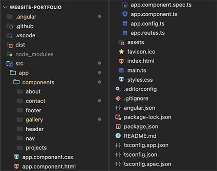

# Working Portfolio
My portfolio was created using Angular and hosted on Azure’s Static Web App through GitHub deployment.

To deploy an Azure Static Web Apps from a GitHub Angular Repository, I followed this [tutorial](https://www.youtube.com/watch?v=oV4XMevxpiM&ab_channel=MicrosoftDeveloper).

Link to the website: [https://www.maximillianmata.com/](https://www.maximillianmata.com/).

# Project Structure📚
Example of the folder structure::  
  
The current long-term support of Node at the time of this commit is v20.11.0 (npm v10.2.4). This project runs using the Angular core framework, and ‘ng serve’ will have it up and running on a local port. 

# Future Versions🔮
- Contact Form HTTP Post
- Working links to Personal Projects
